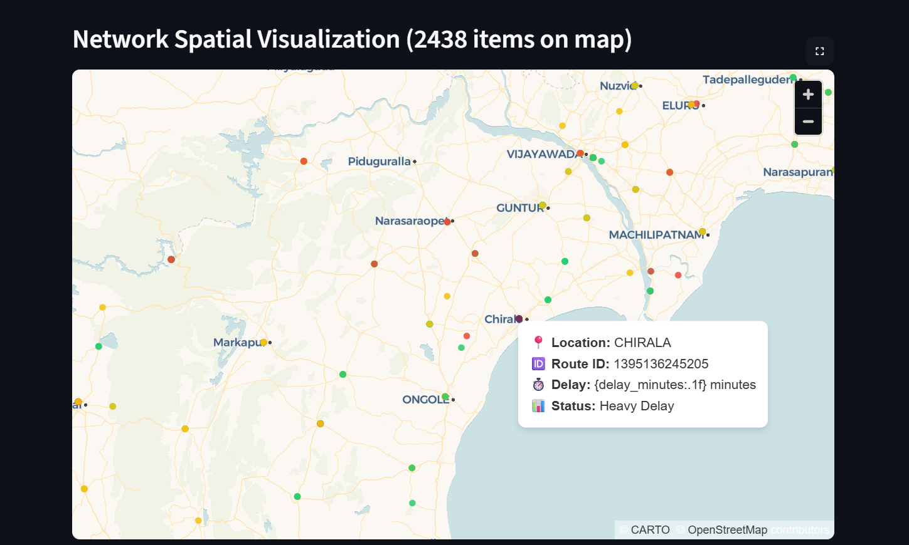
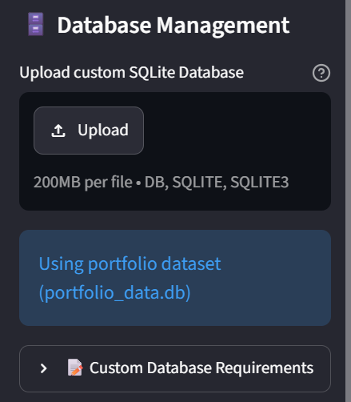
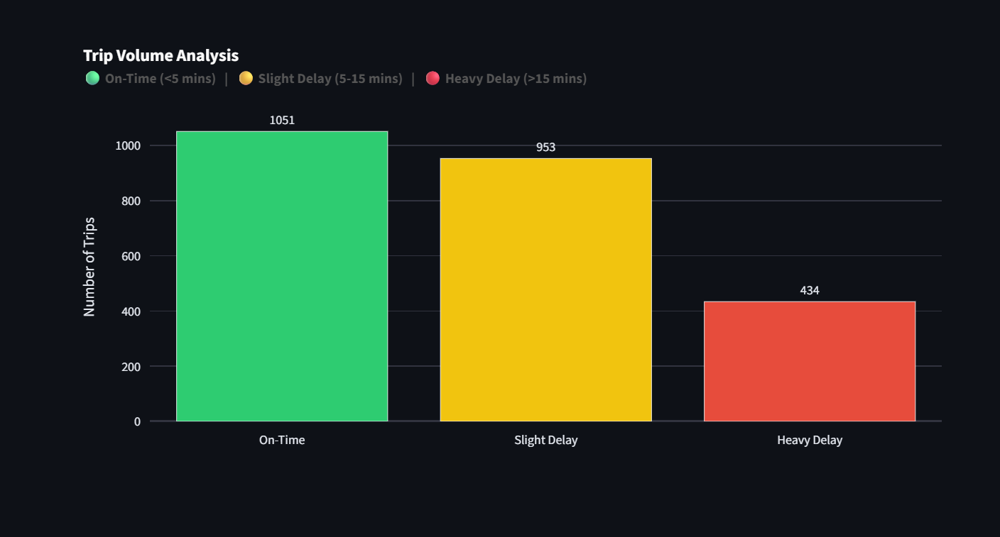
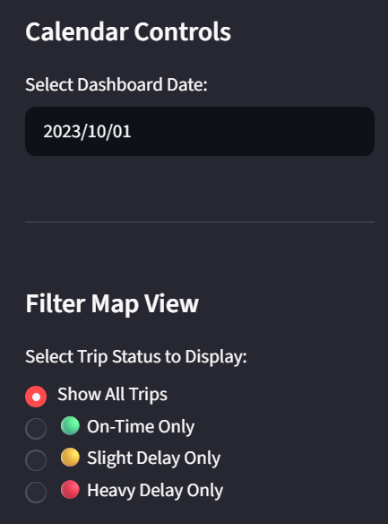

# 🚌 Live Transit Delay Dashboard

<div align="center">
  
  
  
  
  
  
  
  
  **[🔴 LIVE DEMO: Click here to explore the interactive dashboard!](https://live-transit-dashboard-kbqcqptqxt8la2bkhelk3c.streamlit.app/)**
</div>

---

This project is a full-stack transit analytics dashboard designed to parse, process, and visually map massive streams of public transportation telemetry data to identify route delays and system bottlenecks.

By combining back-end data engineering with a reactive front-end interface, it transforms raw SQL relational databases into live, interactive spatial insights.

---

## 🛑 The Core Problem: Big Data vs. Cloud Constraints
Modern public transit networks generate massive amounts of spatial and temporal telemetry data every single day. For this project, the initial challenge was processing a sprawling **40 GB relational SQLite database** containing millions of historical transit trips, schedules, and GPS coordinates across Andhra Pradesh. 


## 💡 The Solution
The engineering challenge was to build a full-stack dashboard that could handle enterprise-scale transit data logic, visualize complex spatial bottlenecks without browser latency, and remain lightweight enough to operate flawlessly in a constrained cloud environment. 

Automated Data Slicing (extract_real_data.py): To bypass cloud storage limits, I wrote an automated extraction script. It connects locally to the massive 40GB database, runs optimized WHERE DATE() SQL queries to isolate a high-density, 1-day sample (October 1, 2023), and writes it to a new, lightweight file (portfolio_data.db). This dropped the asset footprint from gigabytes to megabytes, clearing GitHub's 100MB file limit while preserving the complete production-grade relational schema.


---

## 📸 Dashboard Features


### 📊 Executive KPIs & Spatial Map Engine
To provide instant situational awareness, the dashboard opens with top-level Key Performance Indicator (KPI) cards that dynamically calculate total active trips, network-wide on-time percentages, and average system delays. Below this sits the core spatial visualization engine. Powered by **PyDeck**, the map plots transit data as interactive coordinate points layered over a clean road map. Built-in hover tooltips instantly reveal the exact location name, route ID, and real-time delay metrics for any selected transit node.


### 🗄️ Dynamic Custom Database Uploader
One of the most complex features is the dynamic file uploader in the sidebar, which allows users to upload their own `.db` or `.sqlite` files directly into the live cloud environment. The backend safely caches the file, validates the internal schema to ensure the necessary tables exist, and instantly live-swaps the application's data source, transforming the dashboard into a highly flexible tool.


### 📈 Volume Analysis Plotly Graph
To complement the spatial map, I integrated a reactive **Plotly** bar chart that breaks down the raw volume of trip statuses. As the dataset changes, this graph automatically categorizes the network into clear thresholds: On-Time (<5 mins), Slight Delays (5-15 mins), and Heavy Delays (>15 mins). The chart is explicitly color-coded to perfectly match the spatial indicators on the map.


### 🎯 Reactive Filter Selection
Instead of forcing users to sift through thousands of green on-time dots to find delayed buses, the reactive state-management filter allows them to isolate specific network conditions with a single click. Selecting "Heavy Delay Only" instantly strips away the noise, recalculates the KPIs, updates the Plotly volume graph, and redraws the PyDeck map to display only the most critical transit failures.




---

## 🗺️ Project Architecture Map
Here is how the application is structured under the hood:

```text
Live-Transit-Dashboard/
│
├── app.py                 # The main Streamlit frontend & UI logic
├── database.py            # SQLite connection and backend query engine
├── extract_real_data.py   # Data engineering script (40GB -> Cloud optimized)
├── portfolio_data.db      # The lightweight, extracted dataset for the live web
├── requirements.txt       # Python library dependencies
└── assets/
    └── dashboard_preview.png  # Images for documentation
